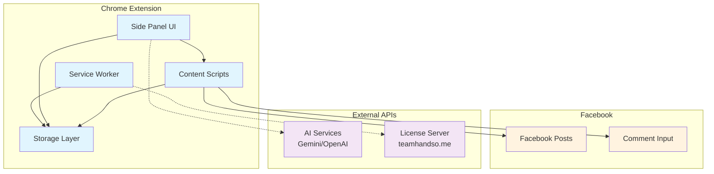

# AdReply Chrome Extension Design Document

## Overview

AdReply is a Manifest V3 Chrome extension that provides intelligent Facebook comment advertising assistance. The system operates entirely client-side, using content scripts for Facebook integration, a side panel for user interface, and local storage for data persistence. The architecture prioritizes privacy, performance, and Facebook compliance through manual-only posting and local data processing.

## Architecture

### High-Level Architecture



### Component Architecture

The extension follows a modular architecture with clear separation of concerns:

1. **Presentation Layer**: Side panel UI with tabbed interface
2. **Business Logic Layer**: Template matching, rotation, and AI integration
3. **Data Access Layer**: IndexedDB and Chrome storage management
4. **Integration Layer**: Facebook DOM manipulation and external API communication

## Components and Interfaces

### 1. Side Panel UI Component

**Purpose**: Provides the main user interface as a fixed right-hand sidebar

**Key Features**:
- Tabbed interface (Adverts, AI Settings, License)
- Real-time comment suggestions display
- Template management interface
- License status and upgrade prompts

**Interface**:
```javascript
class SidePanelUI {
  constructor(storageManager, templateEngine, licenseManager)
  
  // Core UI methods
  renderCommentSuggestions(suggestions)
  updateTemplateList(templates)
  showLicenseStatus(status)
  
  // Event handlers
  onTemplateSelect(templateId, variantIndex)
  onTemplateCreate(templateData)
  onAIRephrase(templateId)
  onExportTemplates(selectedIds)
  onImportAdPack(file)
}
```

### 2. Content Script Component

**Purpose**: Integrates with Facebook's DOM to detect posts and insert comments

**Key Features**:
- Post content extraction and analysis
- Comment insertion into Facebook's input fields
- Real-time page change detection
- Group identification and tracking

**Interface**:
```javascript
class FacebookIntegration {
  constructor(templateEngine, storageManager)
  
  // Core integration methods
  extractPostContent()
  detectCurrentGroup()
  insertComment(commentText)
  
  // Event listeners
  onPostLoad(callback)
  onGroupChange(callback)
  onCommentBoxFocus(callback)
}
```

### 3. Template Engine Component

**Purpose**: Handles template matching, ranking, and rotation logic

**Key Features**:
- Keyword-based template scoring
- Anti-spam rotation algorithm
- Template variant management
- AI-enhanced matching (Pro feature)

**Interface**:
```javascript
class TemplateEngine {
  constructor(storageManager, aiService)
  
  // Core template methods
  async matchTemplates(postContent, groupId)
  async generateSuggestions(matches, count = 3)
  async rotateTemplate(templateId, groupId)
  
  // AI integration
  async rephraseTemplate(templateId, context)
  async generateFromNiche(nicheDescription)
  async enhanceMatching(postContent, templates)
}
```

### 4. Storage Manager Component

**Purpose**: Manages all local data persistence and retrieval

**Key Features**:
- IndexedDB operations for templates and groups
- Chrome storage for settings and license
- Data validation and migration
- Export/import functionality

**Interface**:
```javascript
class StorageManager {
  constructor()
  
  // Template operations
  async saveTemplate(template)
  async getTemplates(filters = {})
  async deleteTemplate(templateId)
  
  // Group tracking
  async updateGroupHistory(groupId, templateId, variantIndex)
  async getGroupHistory(groupId)
  
  // Settings and license
  async saveLicenseData(licenseData)
  async getLicenseStatus()
  async saveAISettings(settings)
  
  // Import/Export
  async exportTemplates(templateIds = null)
  async importAdPack(adPackData)
}
```

### 5. License Manager Component

**Purpose**: Handles Pro license validation and feature gating

**Key Features**:
- JWT token validation
- Monthly license verification
- Feature access control
- Grace period management

**Interface**:
```javascript
class LicenseManager {
  constructor(storageManager)
  
  // License validation
  async validateLicense(token)
  async performMonthlyCheck()
  async checkFeatureAccess(feature)
  
  // License management
  async upgradeToPro(token)
  async downgradeLicense()
  getGracePeriodStatus()
}
```

### 6. AI Service Component

**Purpose**: Integrates with external AI APIs for Pro features

**Key Features**:
- Multi-provider support (Gemini, OpenAI)
- Template rephrasing
- New template generation
- Enhanced context analysis

**Interface**:
```javascript
class AIService {
  constructor(apiProvider, apiKey)
  
  // AI operations
  async rephraseComment(originalText, context)
  async generateTemplates(nicheDescription, count = 5)
  async analyzePostIntent(postContent)
  async rankTemplateRelevance(postContent, templates)
}
```

## Data Models

### Template Model
```javascript
{
  id: "garage_offer_01",
  label: "Garage | Exhaust offer",
  verticals: ["motorcycles", "cars"],
  keywords: ["exhaust", "garage", "fit", "performance"],
  template: "Great build! If you need custom exhaust work, we do same-day fitting — {site}.",
  variants: [
    "Looks ace. We do performance exhaust installs same day — {site}.",
    "Nice work! If you want a quick exhaust swap, we can fit it today — {site}."
  ],
  createdAt: "2024-01-15T10:30:00Z",
  updatedAt: "2024-01-20T14:45:00Z",
  usageCount: 15
}
```

### Group History Model
```javascript
{
  groupId: "facebook.com/groups/123456",
  name: "UK Motorcycle Mods",
  lastTemplateId: "garage_offer_01",
  lastVariantIndex: 1,
  lastUsedAt: "2024-01-20T16:30:00Z",
  totalComments: 8
}
```

### License Model
```javascript
{
  token: "eyJhbGciOiJIUzI1NiIsInR5cCI6IkpXVCJ9...",
  status: "pro", // "free", "pro", "expired", "revoked"
  tier: "pro",
  plan: "monthly",
  expiresAt: "2024-02-20T00:00:00Z",
  lastValidatedAt: "2024-01-20T12:00:00Z",
  gracePeriodEnds: null,
  features: ["unlimited_templates", "ai_integration", "ad_packs"]
}
```

### Settings Model
```javascript
{
  ai: {
    provider: "gemini", // "off", "gemini", "openai"
    geminiApiKey: "",
    openaiApiKey: "",
    enabled: false
  },
  ui: {
    sidebarWidth: 320,
    theme: "light",
    showUpgradePrompts: true
  },
  templates: {
    maxSuggestions: 3,
    enableRotation: true,
    preventRepetition: true
  }
}
```

## Error Handling

### Error Categories and Strategies

1. **Storage Errors**
   - IndexedDB quota exceeded: Prompt user to delete old templates
   - Corruption: Attempt recovery from backup, fallback to fresh start
   - Access denied: Show error message and disable affected features

2. **Facebook Integration Errors**
   - DOM changes: Implement robust selectors with fallbacks
   - Comment insertion failure: Retry with alternative methods
   - Group detection failure: Use URL parsing as backup

3. **License Validation Errors**
   - Network failure: Use grace period, show offline indicator
   - Invalid token: Prompt re-authentication
   - Expired license: Graceful downgrade to free features

4. **AI Service Errors**
   - API rate limits: Queue requests and retry with backoff
   - Invalid API key: Show configuration error
   - Service unavailable: Disable AI features temporarily

### Error Recovery Mechanisms

```javascript
class ErrorHandler {
  static async handleStorageError(error, operation) {
    if (error.name === 'QuotaExceededError') {
      return await this.promptQuotaCleanup();
    }
    // Log error and provide user feedback
    console.error(`Storage operation failed: ${operation}`, error);
    return { success: false, message: 'Storage operation failed' };
  }
  
  static async handleFacebookError(error, context) {
    // Implement retry logic with exponential backoff
    const maxRetries = 3;
    for (let i = 0; i < maxRetries; i++) {
      await this.delay(Math.pow(2, i) * 1000);
      try {
        return await context.retry();
      } catch (retryError) {
        if (i === maxRetries - 1) throw retryError;
      }
    }
  }
}
```

## Testing Strategy

### Unit Testing
- **Template Engine**: Test keyword matching, scoring algorithms, rotation logic
- **Storage Manager**: Test CRUD operations, data validation, migration
- **License Manager**: Test JWT validation, feature gating, grace periods
- **AI Service**: Test API integration, error handling, response parsing

### Integration Testing
- **Facebook Integration**: Test DOM manipulation, event handling, page navigation
- **Side Panel Communication**: Test message passing between components
- **Storage Integration**: Test data flow between UI and storage layers
- **License Flow**: Test end-to-end upgrade and validation process

### End-to-End Testing
- **Comment Suggestion Flow**: Full user journey from post detection to comment insertion
- **Template Management**: Create, edit, delete, and organize templates
- **AI Features**: Test rephrasing and generation with mock API responses
- **License Upgrade**: Test purchase flow and feature unlocking

### Performance Testing
- **Template Matching Speed**: Ensure sub-100ms response for suggestion generation
- **Memory Usage**: Monitor extension memory footprint during extended use
- **Storage Performance**: Test IndexedDB operations with large template libraries
- **UI Responsiveness**: Ensure smooth interaction during background operations

### Security Testing
- **JWT Validation**: Test token tampering and expiration scenarios
- **API Key Protection**: Ensure secure storage and transmission
- **XSS Prevention**: Test content sanitization for user-generated templates
- **Permission Validation**: Verify minimal Chrome permissions usage

### Browser Compatibility Testing
- **Chrome Versions**: Test on current and previous major Chrome versions
- **Facebook Layout Changes**: Test resilience to Facebook UI updates
- **Extension Updates**: Test data migration between extension versions
- **Manifest V3 Compliance**: Ensure full compatibility with latest standards

## Implementation Phases

### Phase 1: Core Infrastructure (Week 1-2)
- Set up Manifest V3 extension structure
- Implement basic storage layer with IndexedDB
- Create side panel UI framework
- Develop Facebook content script integration

### Phase 2: Template System (Week 3-4)
- Build template creation and management UI
- Implement keyword-based matching algorithm
- Develop rotation and anti-spam logic
- Add template import/export functionality

### Phase 3: License System (Week 5-6)
- Implement JWT-based license validation
- Create upgrade flow and payment integration
- Build monthly validation system
- Add feature gating for Pro features

### Phase 4: AI Integration (Week 7-8)
- Integrate Gemini and OpenAI APIs
- Implement template rephrasing features
- Add AI-enhanced matching capabilities
- Build template generation from niche descriptions

### Phase 5: Polish and Testing (Week 9-10)
- Comprehensive testing across all components
- Performance optimization and error handling
- UI/UX refinements and accessibility improvements
- Chrome Web Store preparation and submission